# ToDoListApp
Task is a simple to use to-do list app that can help you plan, track, and get more tasks done. You can create unlimited tasks, set status, assign tasks to team members, create to-do list task in tasks. 

## Features
- Add, Delete, update and Read functionality(CRUD operation) for Todo task.
- Swipe Rigth to Left Functionality for Delete of Task.
- Swipe Left to Right Functionality for Update of Task.
- Login and Register Functionality using SQL Firebase Database.
- Forget Password will send Password Link into User Email address.
- Task Details store in SQLite Database.
- Testing of the database done.

Login          |  Register                      | Login with Email & Password              |  Notification Alert
:----------------------------:|:--------------------------------------:|:----------------------:|:-----------------
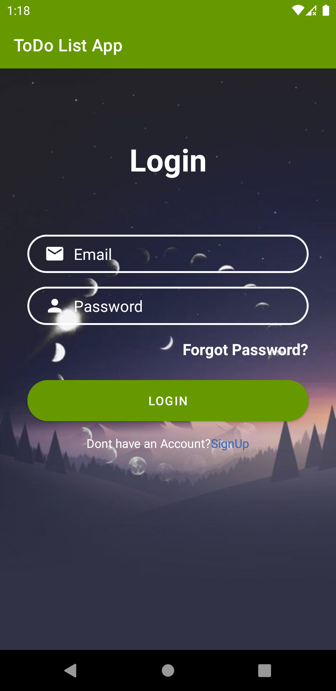  |  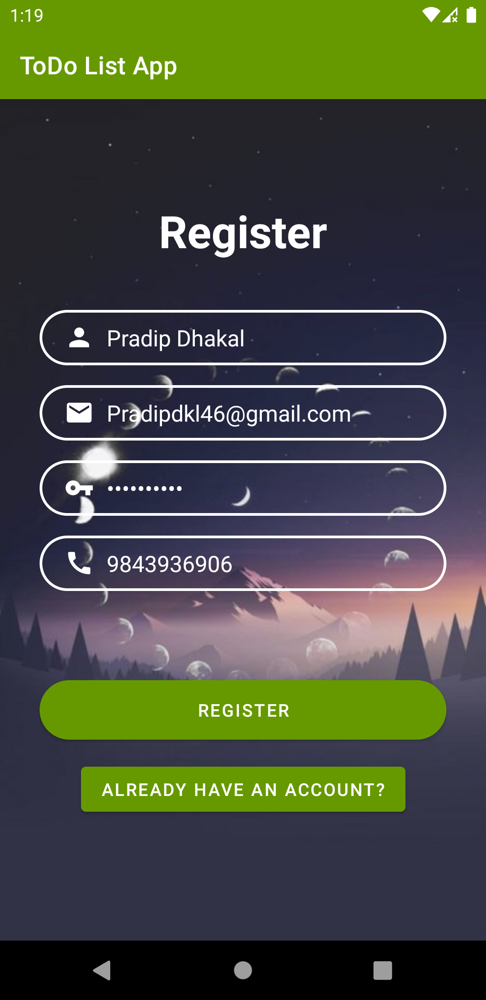        |  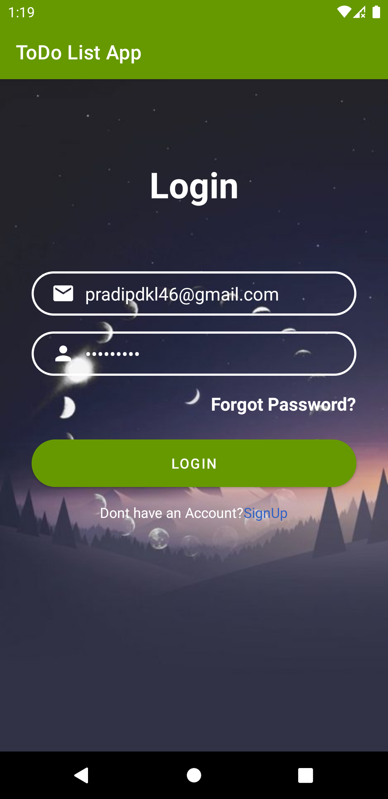  | 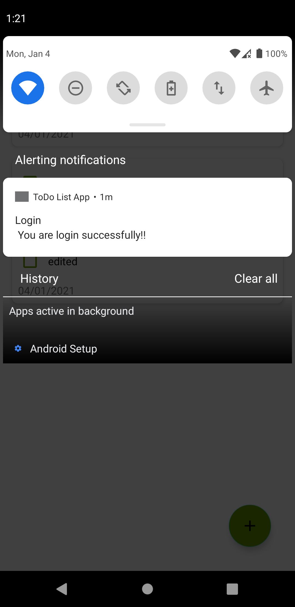
#
Dashboard          |  Added Task                   | After Added Task              |  Swipe Left to Delete The Task 
:----------------------------:|:--------------------------------------:|:----------------------:|:-----------------
 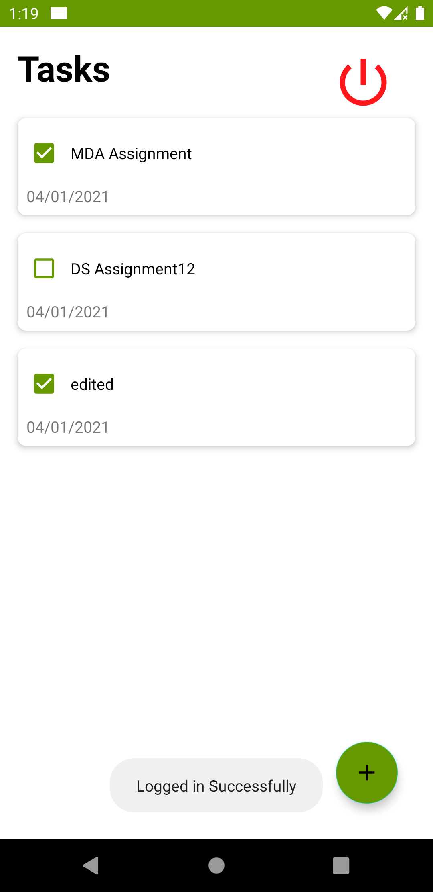 |   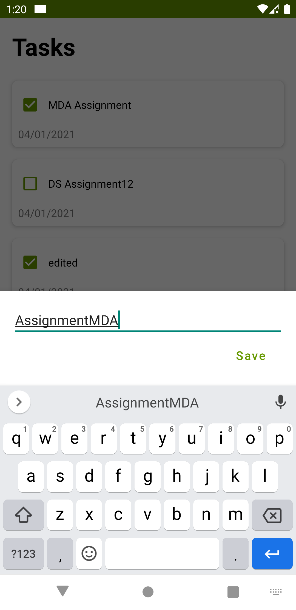        | 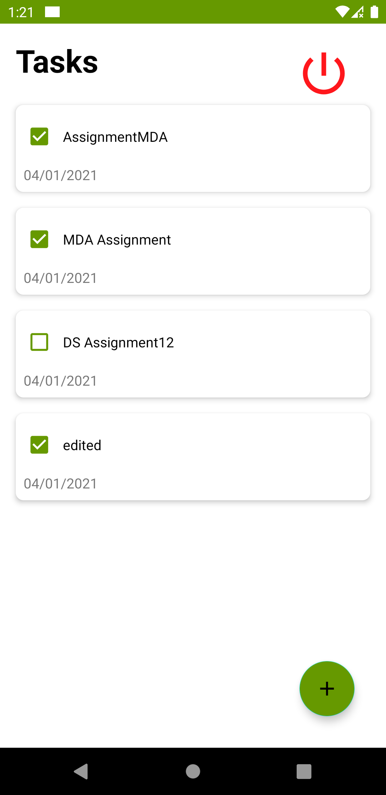   | 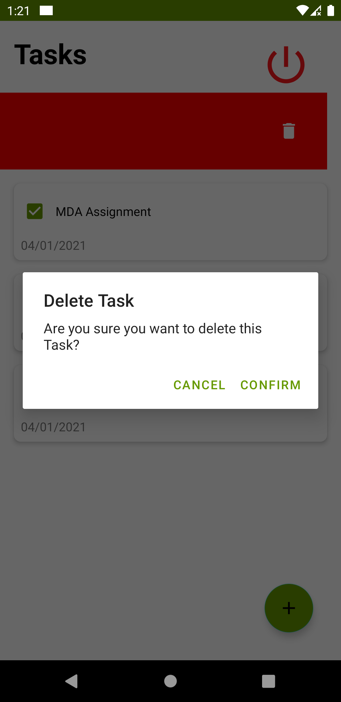
#
After Deteled The Task    |  Swipe Right to Update The Task       | After Update The Task     |  Logout
:----------------------------:|:--------------------------------------:|:----------------------:|:-----------------
 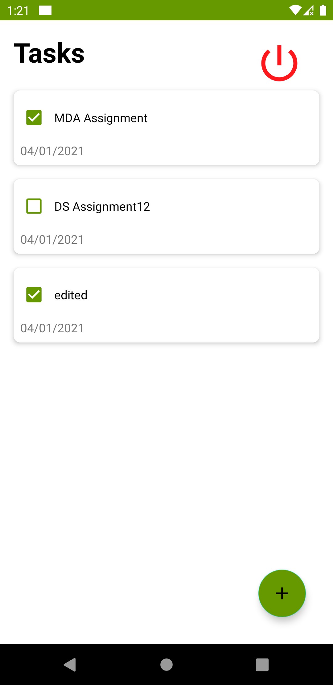 |   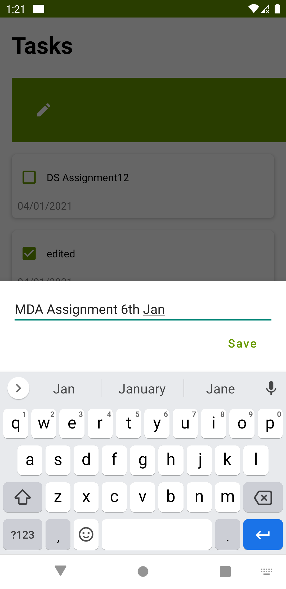        | 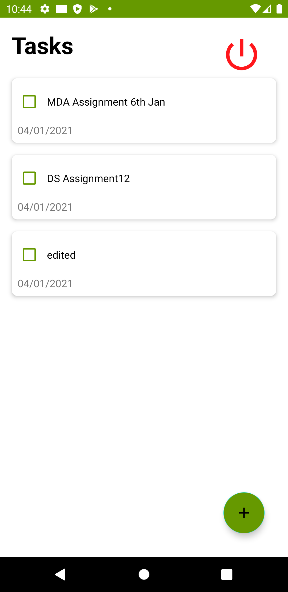   | 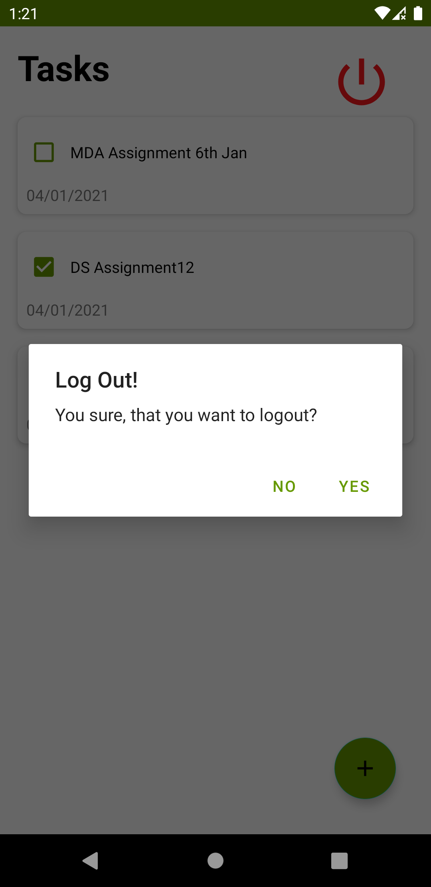
#
Forget Paasword          |  Rotate the Task 
:----------------------------:|:--------------------------------------
 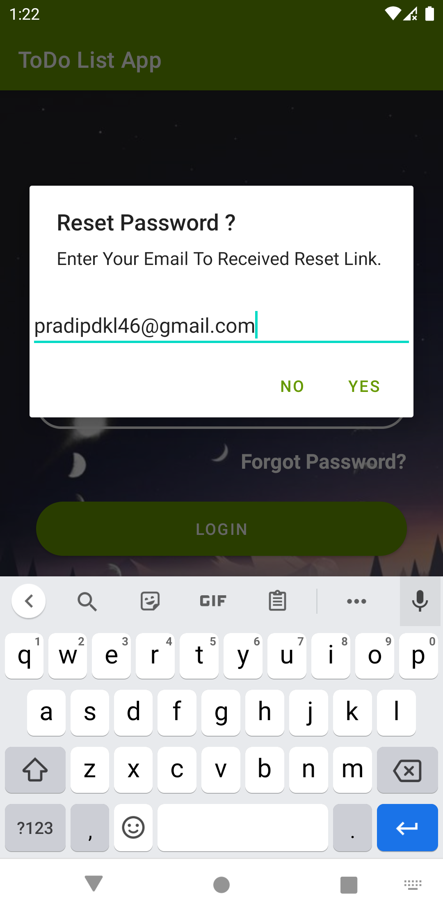 |   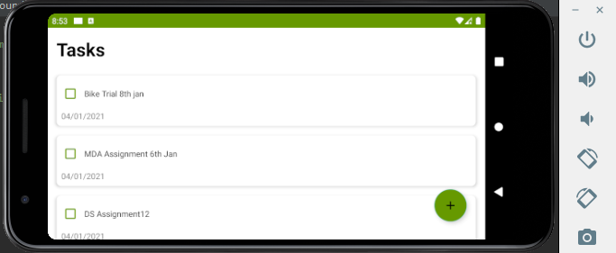
 
 ## About Installation (Installing and using the App)
#### ***1 Register/ Sign Up:*** : Fill the Required Information and Register.
#### ***2 Login:*** : After Register Login with the same credentials.
##### ***3 Todo List:*** : Click on Plus Add Icon and create the Todo Task
#### ***4 Todo Dashboard:***  : After creating a Todo Task ,Now Ypu can see into Dashboard.
#### ***5 Editing the Todo Items:*** : Swipe left to right todo task and edit it.
#### ***6 Deleting the todo items and list:***. : Swipe right to left todo task and delete it.
#### ***7 Sorting or filtering out:*** : Tick the completed and untick incomplete Todo task.
#### ***8 Logout :*** : Click on Logout to end the session.

# Documentation

<b>Android Architecture components</b> are a collection of libraries that help you design robust, testable, and maintainable apps with more power over lifecycle management and data persistence. User need to login first to entered into application and all data were shows for all user. In future work, only user can see their data and other entry user can't able to see other user data.

# MVVM
Model–view–viewmodel (MVVM) is a software architectural pattern that facilitates the separation of the development of the graphical user interface (the view) be it via a markup language or GUI code from the development of the business logic or back-end logic (the model) so that the view is not dependent on any specific model platform. The view model of MVVM is a value converter,meaning the view model is responsible for exposing (converting) the data objects from the model in such a way that objects are easily managed and presented. In this respect, the view model is more model than view, and handles most if not all of the view's display logic.The view model may implement a mediator pattern, organizing access to the back-end logic around the set of use cases supported by the view.
There are 3 parts to the Model-View-ViewModel architecture:-

   1. <b><u>Model</u></b> is the data layer of your app. It abstracts the data source.
   2. <b><u>View</u></b> contains the UI of your app. Most often it’s implemented as an Activity or Fragment. View informs ViewModel of user interactions and displays results received from the ViewModel. View should be lightweight and contain zero to very little business logic.
   3. <b><u>ViewModel</u></b> serves as a bridge between your View and Model. It works with the Model to get and save the data. The View observes and reacts to the data changes exposed by the ViewModel.

Here is a typical high-level MVVM app architecture:

